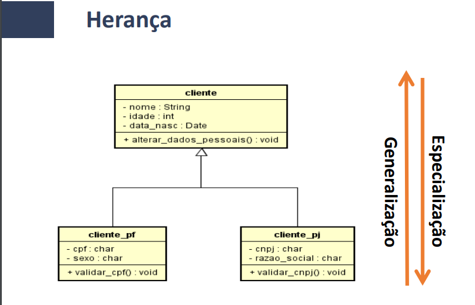
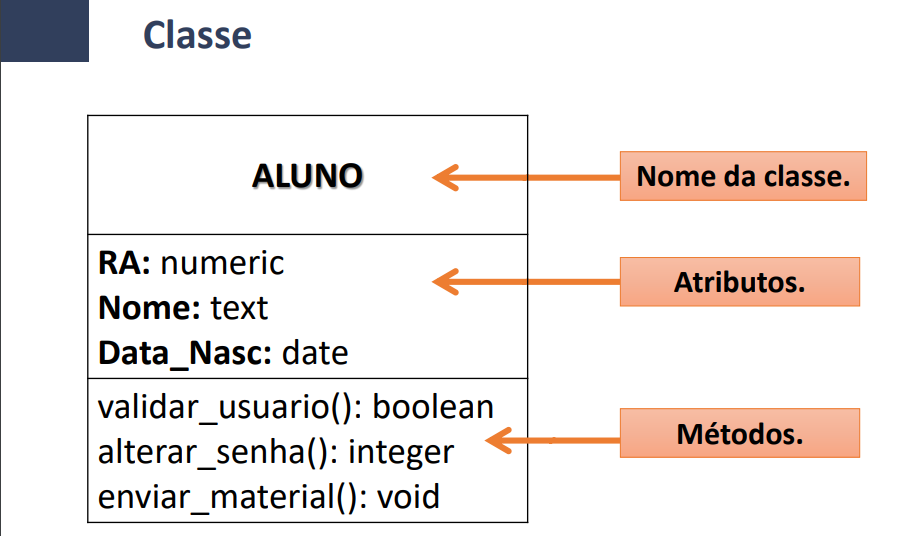

# Objetivos da Matéria:

Conhecer ferramentas CASE, que auxiliam a velocidade e qualidade das entregas na engenharia de software

Ferramentas para UML

## Tema #1 - Ferramentas para Levantamentos de Requisitos de Sistema

ALM - Application Lifecycle Management
Gerenciamento do ciclo de vida do software
Ciclo Inicia na necessidade de criação do software e finaliza na necessidade de substituí-lo.

### Requisitos
Necessidades do cliente que devem ser resolvidas pelo sistema
- Funcionais (Funcionalidades e Regras de negócio) 
- Não funcionais (Qualidade, Segurança) 

Identificar e mapear requisitos, 
Ferramentas: RE-Tools, Jira, Visure

Ferramentas para Bancos de dados e front-end
## Banco de dados
Ferramentas: DB-Main (descontinuado), BrModelo, DB Design, ERwin

### UX 
User Experience  
Ferramenta para criar protótipos da interface - também chamado de Wireframe.  
Define de forma antecipada a estrutura dos componentes da interface  

Ferramentas: Axure, Sketch (MacOS) e (não citada) Figma

### Programação Orientada a Objetos
Trata-se de um conjunto de classes que irão definir os objetos presentes em um sistema.  
Determina:
  - comportamento (métodos)
  - estados possíveis (atributos)
  - relacionamentos

Ferramenta: Visual Paradigm e (não citado) Drawio (app.diagrams.net)

## Tema 02 - Introdução a Modelagem de Sistemas
Segunda etapa do ciclo de desenvolvimento de software  

 - Modelagem de Banco de Dados
 - Modelagem do sistema (Diagramas UML)
 - Documentação do software
 - Manual do usuário
 - Help do sistema
 - Definição do Cronograma de implementação

### UML
Referencia para estruturar o software  
- Possui 14 diagramas que representam o software em diferentes perspectivas  
- É Universal  
- Todo desenvolvedor tem por obrigação entender uma modelagem desenvolvida através de UML

#### Diagramas:
 - Estruturais:
   - **Classes**, objetos, componentes, pacotes, instalação/implantação, perfil e estruturas compostas.
 - Comportamentais:
   - **Casos de Uso**, máquinas de estado e atividades.
 - Interação:
   - Interação, **Sequência**, colaboração/comunicação e tempo.

### Diagrama de classes
• É o principal diagrama da UML.  
• É uma representação do sistema no ponto de vista dele mesmo, ou seja, de dentro para fora.  
• Representação estática  
• É composto pelas classes e suas associações

Uma classe é formada por Métodos e Atributos 

Herança:

Representação de Classe no UML:

### Diagrama de casos de uso
• É o diagrama mais geral da UML.
• Representa o sistema no ponto de vista do usuário, ou seja, de fora para dentro.
• Um caso de uso, representa uma ação a ser realizada no sistema de software.
• Caso de uso é a representação de uma funcionalidade do sistema

### Diagrama Sequencial
• É uma representação dinâmica do sistema a ser desenvolvido, ou seja, o sistema em execução.  
• Representa a sequência passo a passo das ações executadas no sistema e também os possíveis retornos de cada uma dessas ações.  
• Representa o funcionamento desse sistema de maneira simples e lógica.  

Exemplos
JUDE (ASTAH), Netbeans, Microsoft Visio.

##### Dica do professor (boa)
App Edraw Max