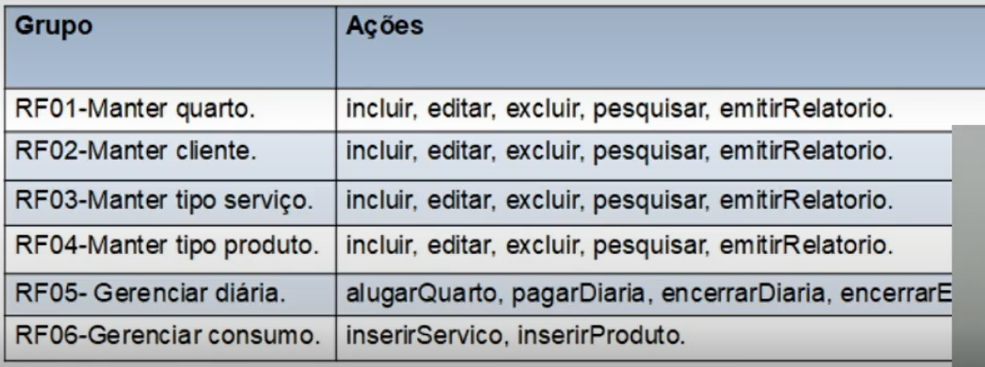
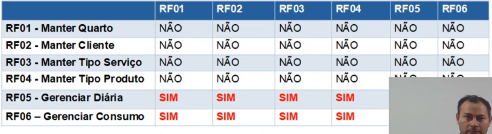
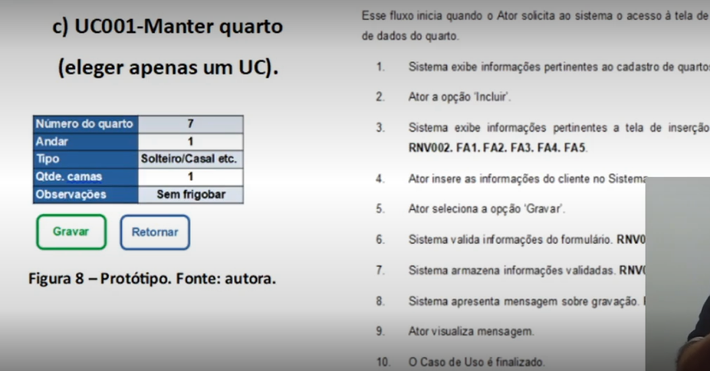
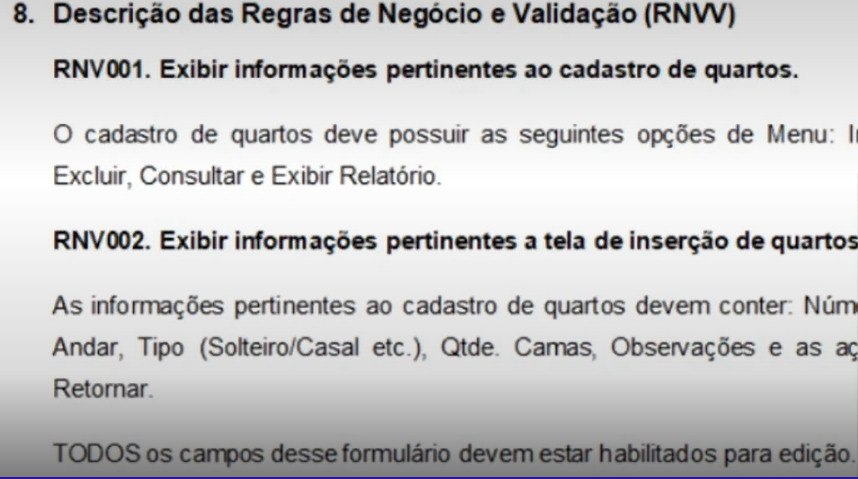

O processo completo da Especificação de Requisitos é, mas não se restringe a:

### 1° Identificar e Classificar Requisitos

### 2° Matriz de Relacionamentos
Descreve como os requisitos se relacionam entre si.

### 3° Especificação
Especifica cada um dos Casos de Uso. Caminho feliz / "Sunny day".  
O protótipo é opcional.
Podem ser descritos fluxos alternativos.  

### 4° Descrição das Regras de Negócio e de Validação (RNVV)

Depois, os próximos passos são a Análise e Modelagem.
