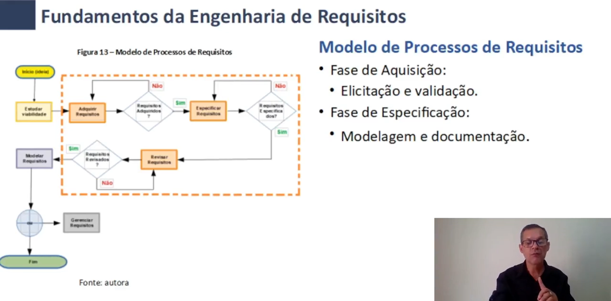

# Fundamentos
A Engenharia de Requisitos se preocupa em transmitir a ideia do produto do cliente para a equipe do projeto

Processo da Engenharia de Requisitos:  
Derivar Validar e Manter o documento de Especificação

## Função e Atribuições do Analista
O analista de requisitos é responsável pelo Levantamento, Indicação, Análise e Modelagem do projeto

### Responsabilidades
Compreender a ideia do produto
Realizar eventuais sugestões/intervenções
Modelar a ideia
Documentar e efetuar eventuais mudanças
Ser o Elo entre a equipe e o cliente 

## Ciclo de Desenvolvimento de Software  
Uma Forma de organizar as fases do trabalho. Possui metodologias, ferramentas e responsáveis.  

1 - Planejamento  
2 - Análise - Se deve fazer as perguntas: O que? Para que/por que? Como? Quem? Quando? (Compreensão da demanda)  
3 - Projeto/Desing/Modelagem  
4 - Implementação  
5 - Entrega  

Requisitos devem ser Claros, Objetivos, Concisos e Íntegros.

Identificar analisar modelar testar documentar os requisitos

## Tipos e Classificação dos Requisitos
Apenas 3 tipos: Funcionais, Não Funcionais e de Negócio
