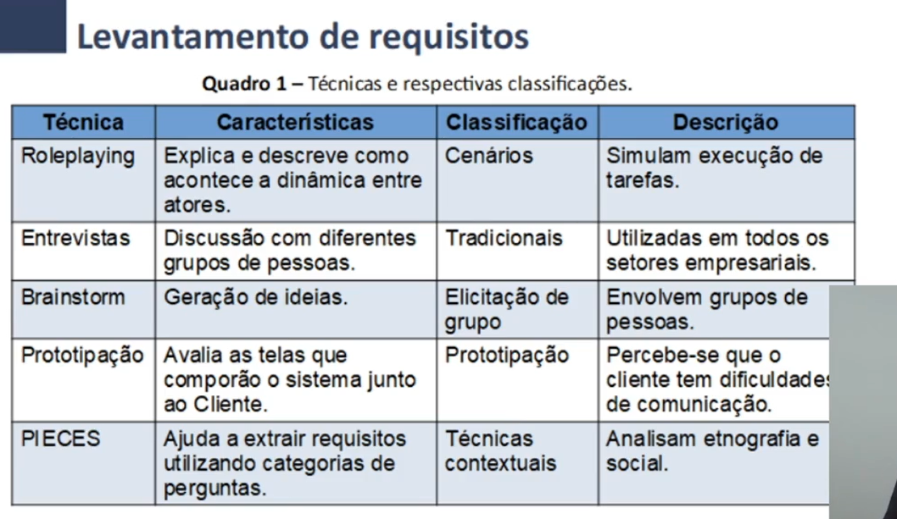
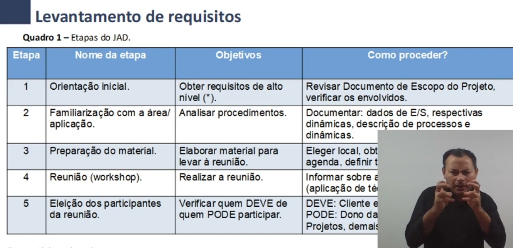
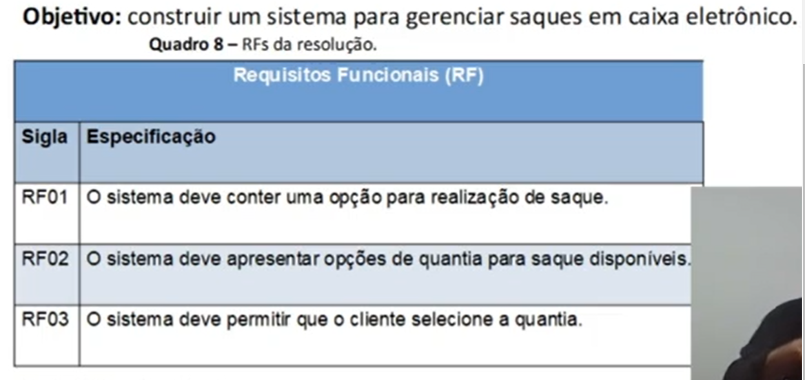
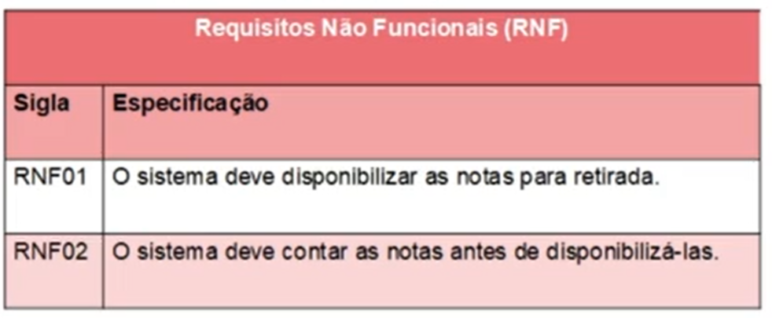
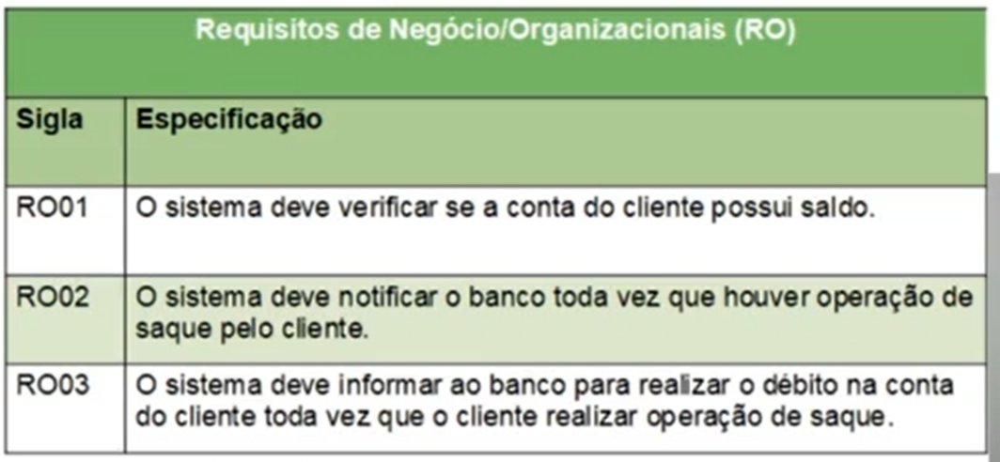

# Levantamento de Requisitos
A base do levantamento dos requisitos é **a comunicação (símbolos e palavras)**.

**A comunicação é a chave para o sucesso do projeto.**

## Organização 
Técnica de Reunião JAD - Join Application Design
Pilares: Cooperação, entendimento e trabalho em equipe  
Objetivo: Obter o consenso de todos os envolvidos quanto aos requisitos  
Caracteristicas: Agenda para tratar de cada parte do software

Ciclo de Interação JAD
Obter -> Construir -> Gerar
(dados, ideias, datas, endereços para reuniões, técnicas, enfim)

## Especificação dos Requisitos
Depois dos requisitos levantados, especificamos em alto nível depois em baixo nível
Deve: garantir complitude, concistência entre requisitos, coerência 

### Nomenclatura para Escrita
Sujeito + Verbo ou Locução verbal + Complemento

O SISTEMA | DEVE CONSERVAR | O HISTÓRICO DOS PAINEIS  
O SISTEMA | DEVE CAPACITAR | 300 USUÁRIOS SIMULTÂNEOS  
O SISTEMA | DEVE SER CAPAZ DE FUNCIONAR | EM DISPOSITIVOS PORTÁTEIS  

## Exemplo:

