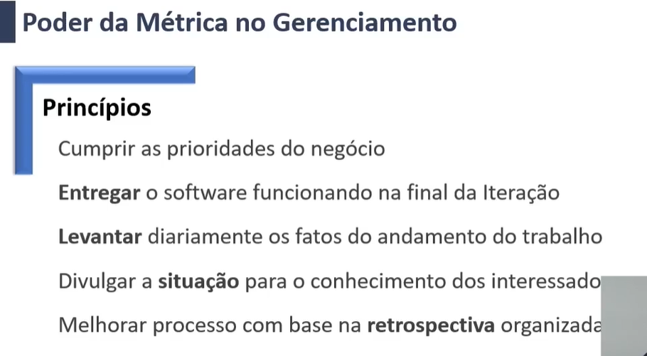
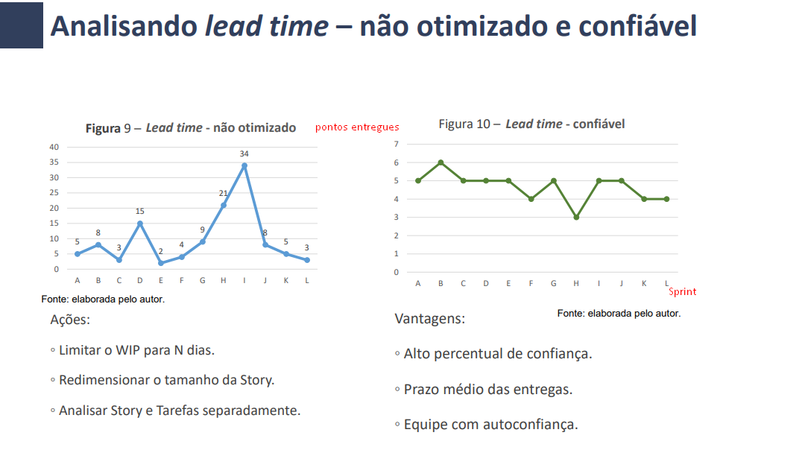

Principais Métricas:
Gráfico de Burndown

Lead Time: Tempo que uma tarefa leva até sair do A Fazer para Pronto
(A Fazer > Desenv. > Teste > ... > Pronto)

Análise de Lead Time

6 diretrizes dos métodos ágeis

- Não possui um processo definido em procedimentos, mas é bem pragmático em valores e princípios 
- Não estima em horas, estima-se o tamanho da história do usuário
- A meta é alcançar o sucesso a cada iteração, com o software funcionando por completo
- Os eventos com tempo máximo de duração (Timeboxed) tem por objetivo manter a ordem e e cumprir a tarefa previamente planejada
- Constantemente medir o time que é o poder de entrega numa iteração
- A melhoria continua é praticada de forma agil analisando o resultado das métricas (em processos e requisitos)
