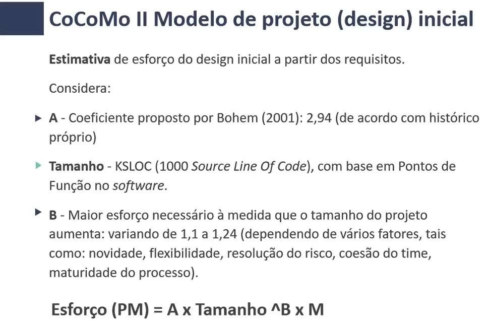
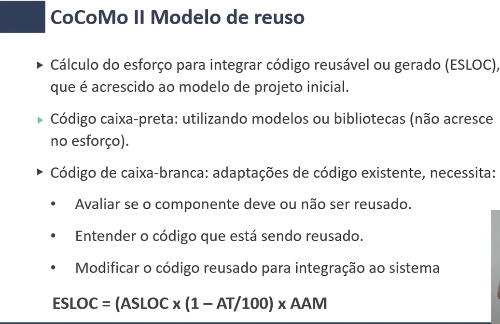
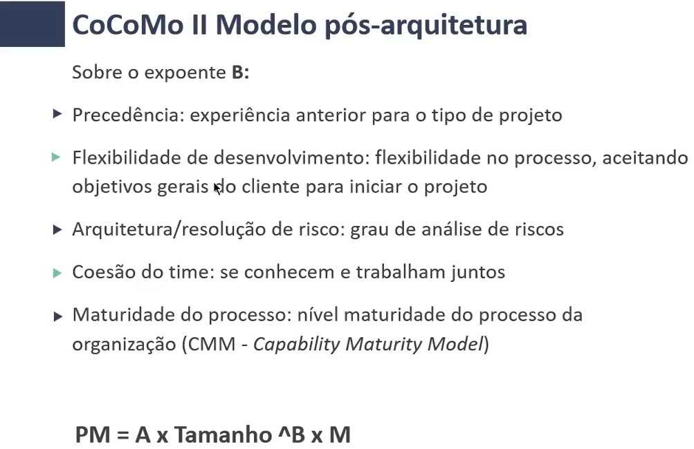
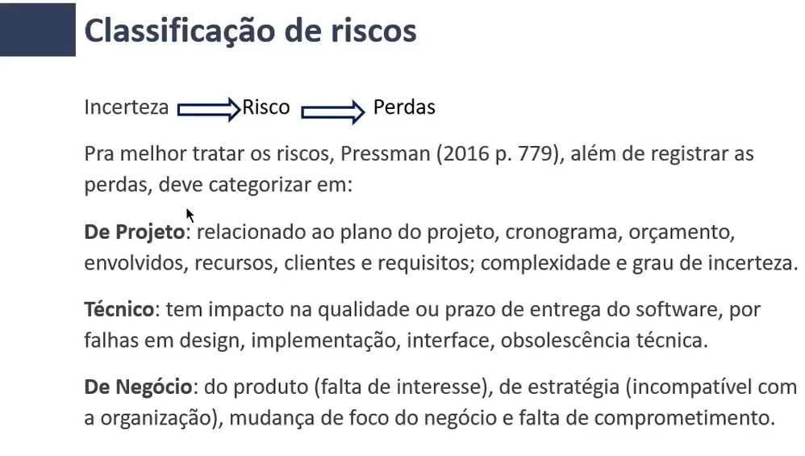
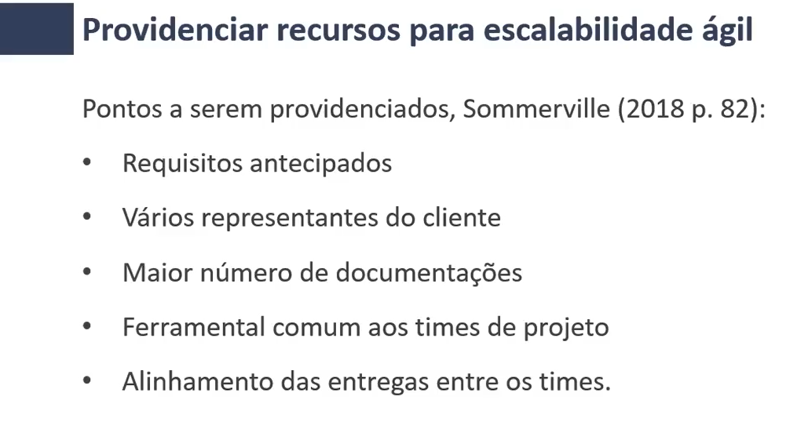
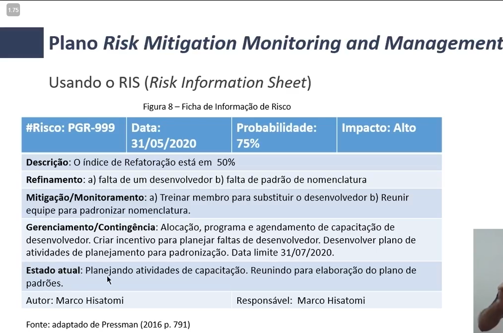

# Gestão de Riscos e Custos com CoCoMo II 

CoCoMo II é a Modelagem Construtiva de Custo desenvolvida pela University of Southern California - Los Angeles

**"É um método que estima esforço, quantidade
de pessoas necessárias na equipe, prazo do serviço e custos de um projeto de desenvolvimento de software"** - Boehm (2000
apud LÓPEZ, 2005)
- Preparado para abordagens modernas: Desenvolvimento rápido com linguagens dinâmicas, reuso de código fonte, programação em banco de dados

## Composição da Aplicação
Utiliza de fórmulas para calcular Estimativa de acordo com a DIFICULDADE que foi determinada na fase de prototipagem

Considera:
- Produtividade/pessoa (PROD) - 4 a 50
- Percentual de reuso do software existente
- NAP - Número total de Pontos da Aplicação

** PM = (NAP x (1 - %reuso/100)) / PROD**

## Modelo de projeto (design) inicial

## Modelo de Reuso

# Modelo pós-arquitetura

# Riscos
## Classificação de Riscos
Pressman, 2016 p. 779

## Escalabilidade Ágil

## Plano Risk Management Monitoring and Management

