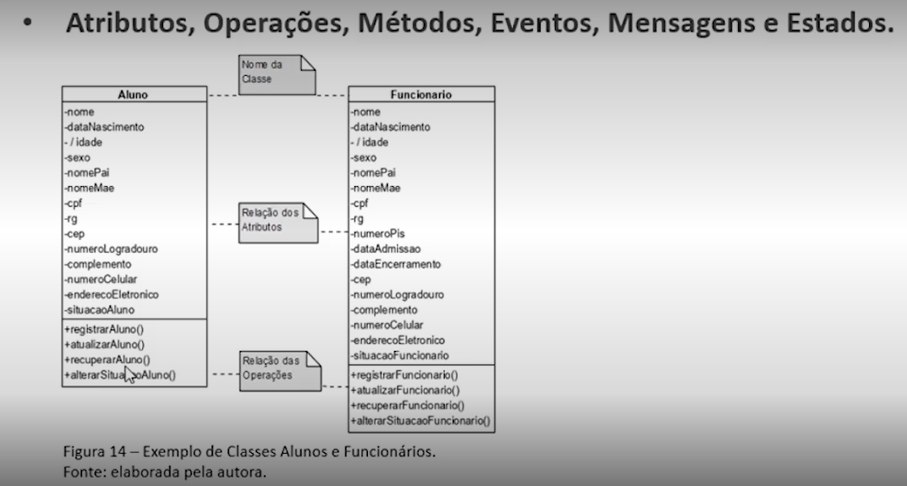
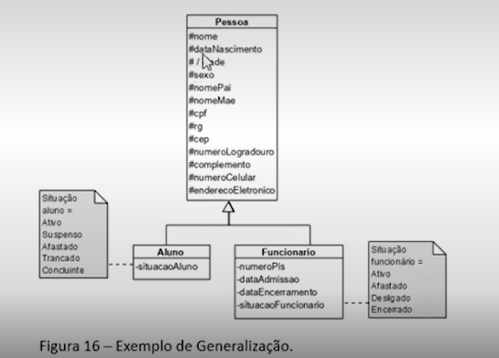
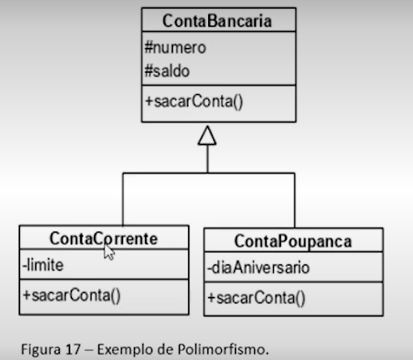
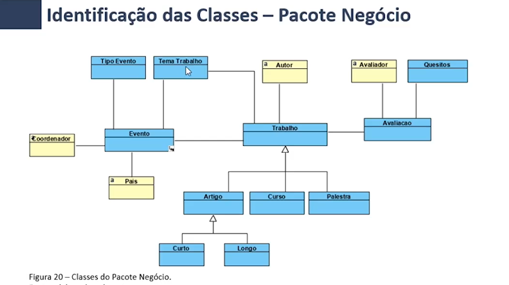
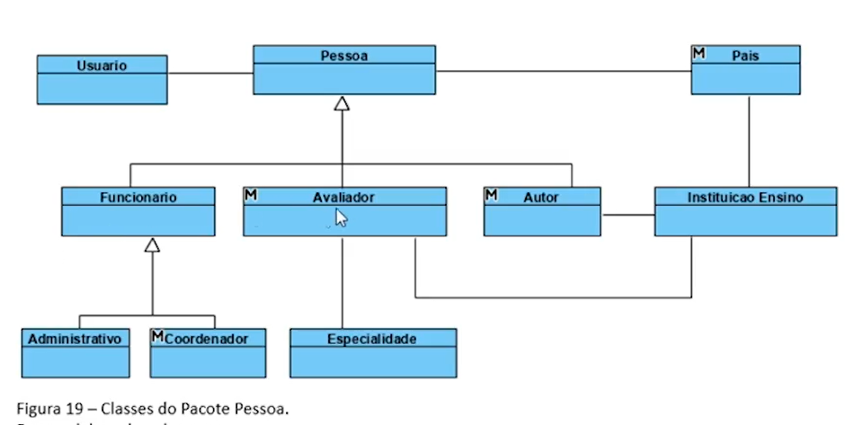

# Introdução

Adoção de um processo se torna o guia do desenvolvimento  
Considera-se que as primeiras etapas (requisitos e análise) são as etapas essenciais para a modelagem de um software, que sustentam o processo e entrega de acordo com os requisitos.

# Bloco 1
## Evolução do Processo de Análise
- Desde 1970 abordagem estruturada
- A partir de 1990 abordagem de análise orientada a objeto

Independente de qual abordagem, devemos seguir um modelo

- Modelo Prescritivo  
  - Tradicionais
  - Modelos Cascata, Iteração, Prototipação, Espiral.
- Modelo Especalizado
  - Restrito a proposta do desenvolvimento:
  - Desenvolvimento baseado em Componentes, Orientado a Caso de Uso
  - Modelos: Iteração, Incremental.
  - Ampara a UML
- Metodologia Agil

## Camadas da Engenharia de Software
Foco na Qualidade, Processos, Métodos, Ferramentas

### Processos
Conjunto de ações para conduzir a criação dos artefatos e do software

### Métodos
Detalhes de como construir o software. Segue a abordagem do modelo e dos processos.

#### Principais métodos orientados a objetos:
- Método de Shlaer e Mellor (análise orientada a objetos) - 1988
  -  Enfatiza a modelagem consistente dos objetos e seus agrupamentos, a partir de mecanismos que facilitam a representação dos objetos, permitindo que a especificação dos modelos de análise seja traduzida para implementação. 
  - Principais técnicas: diagrama de objetos, diagrama de estados, diagrama de fluxo de dados e diagrama de ações.
- Método de Rebecca Wirfs-Brock - 1990
  - Enfatiza o princípio de gerenciamento por responsabilidades, por meio da técnica Class-Resposability-Collaboration (CRV)
- Método de Grady Booch - 1991
  - O sistema é analisado a partir de visões, onde cada visão é descrita por modelos e diagramas. O método contempla técnicas de
modelagem aplicadas às fases de análise e projeto.
  - Principal Técnica: Diagrama de Classes.
- Object Modelling Technique (OMT), James Rumbaugh - 1991
  - método conservador no uso da teoria de objetos, contemplando técnicas de modelagem para especificação da análise de requisitos, análise, projeto e implementação.
  - A modelagem se inicia com a descrição do enunciado do problema, na sequência, especifica-se a modelagem de objetos, a modelagem dinâmica e a modelagem funcional, destacando o tratamento dos processos. Durante a fase de projeto, consiste a especificação em projeto de objetos e projeto do sistema.
- Object-Oriented Software Enginneering (OOSE) e o Objectory, Ivar Jacobson - 1992
  - Enfatizam a modelagem baseada em requerimentos, especificada por meio de use cases (casos de uso), que definem os requisitos iniciais do sistema. O método OOSE é um método orientado a objetos, com abordagem dirigida a cenários, e o método Objectory é aplicado a diferentes domínios de sistemas, principalmente, para modelagem organizacional. O método OOSE contempla as fases de análise, projeto e implementação. Na fase de análise, os principais modelos são o modelo de requisitos e o modelo de objetos.

#### SURGIMENTO DA UML
Assim, os metodos de Booch, Jacobson e Rumbaugh foram somados e o melhor de cada método foi unificado em uma Linguagem

**Assim surge a UML - Linguagem de Modelagem Unificada.**
Em 1997 a primeira versão foi comercializada, UML 1.1

### Ferramentas
Oferecem o apoio automatizado aos métodos de desenvolvimento

# Bloco 2
## Conceito de Modelo
Modelagem de um sistema 
Abstrair as necessidades diante do problema a partir dos requisitos.

A UML possui 14 técnicas de modelagem: Estruturais e Comportamentais

Primeiro Diagrama é de Casos de Uso
Relacionar os casos de uso em um conjunto constituindo um modelo de use cases

Um conjunto de Diagramas de Classes constituem um Modelo de Classes

# Bloco 3

## Conceito de Objeto
Qualquer coisa concreta ou abstrata que pode ser descrito por suas características ou comportamentos.  

Todo objeto deve ter uma identificação.   

Uma **classe** representa um grupo de objetos do mundo real que possui tipos de características e de comportamento em comum. 

### Estado:
Representação de um objeto em um determinado instante de tempo

### Encapsulamento:
Reunião de todos os atributos e métodos em uma única estrutura (classe) de forma protegida.

### Herança:
 (aka generalização) propriedade pela qual uma classe pode **herdar atributos e operações de uma superclasse** que generaliza as características e comportamentos comuns de grupos de objetos.

### Polimorfismo:
O mesmo método ("operação") pode atuar de diversas formas em classes distintas. Um **método polimórfico possui o mesmo nome em duas classes distintas, mas a implementação é diferente**.

### Abstração:
concentração dos aspectos importantes e relevantes dos objetos, considerando o contexto
analisado e o domínio do sistema.

### EXEMPLOS DE MODELAGEM
* DICA:  A leitura de herança pode ser feita como "menor É UM TIPO DE maior" ou "maior ENGLOBA menor".
* Essa frase pode também ser usada como pergunta para validar a herança das classes (ex: artigo É UM TIPO DE trabalho?).

Pessoa 

