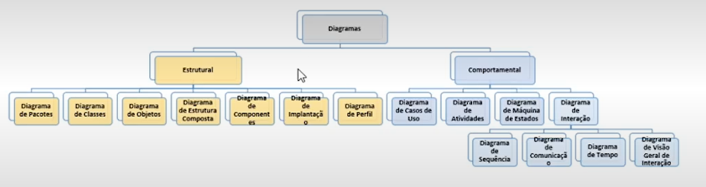
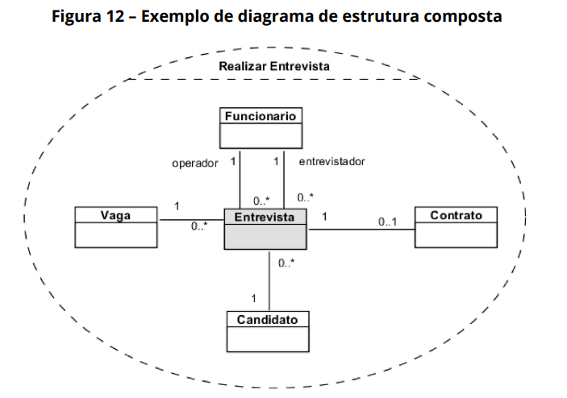
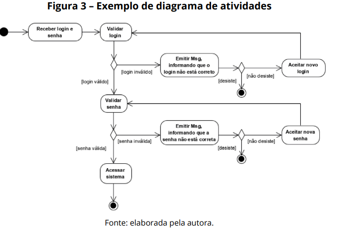
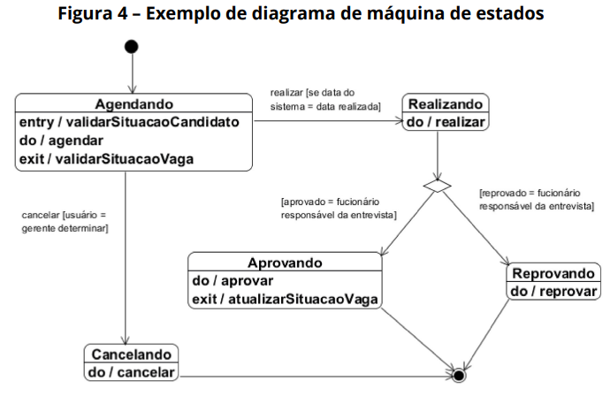
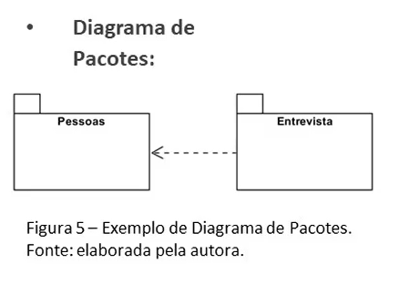
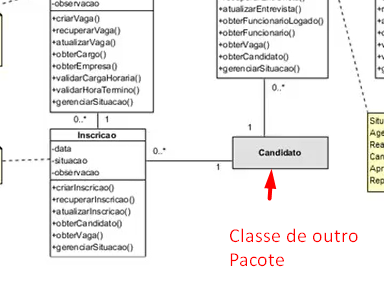
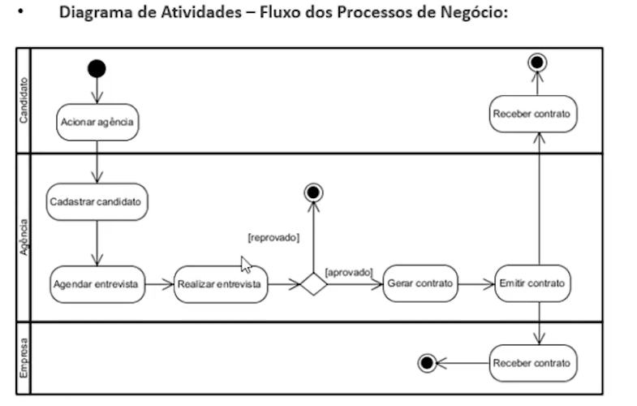
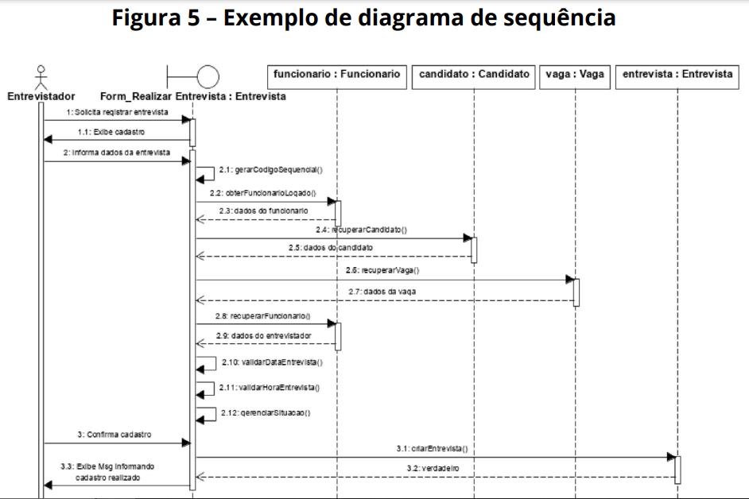

# Bloco 1

A UML - Linguagem de Modelagem Unificada - é um conjunto de 3 métodos orientados a objetos - de Booch, Jacobson e Rumbaugh.

 O propósito da UML é ser uma linguagem padrão para **especificação, visualização** e **construção** de **artefatos de software.**

Em 1997 a UML foi (v.1.1) lançada, e hoje ela é mantida e administrada pela OMG - Object Management Group. Acompanhando a evolução das tecnologias de desenvolvimento, sofreu adaptações e melhorias em suas técnicas.

A versão atual é a versão 2.5 (2017), que possui além dos demais o **Diagrama de Perfil**

## Principais Diagramas
- **Diagrama de Use Cases** - Ivar Jacobson foi amplamente adotado 
- **Diagrama de Classes** - Grady Booch
- **Diagramas Comportamentais** - Rumbaugh

Detalhes: ver Tema 01.

## Características
- Centrada na Arquitetura - Contemplando a parte lógica e física 
- Orientada a Casos de Uso - Cada use Case reflete Requisito(s) Funcional(is)
- Processo iterativo - Evolução de detalhes em cada etapa da modelagem

**Perspectivas de visões da modelagem**:
- **Estrutural**: Diagrama de Classes / Diagrama de Estrutura Composta / Diagrama de Pacotes
- **Funcional**: Diagrama de Casos de Uso
- **Temporal**: Visão em Tempo de Execução - Eventos e interação entre os objetos em tempo de exec. | Diagrama de Estado

## Técnicas e Classificação 
Mantem a estrutura das 3 perspectivas em 2 categorias: Estruturais e Comportamentais

Considerações

- Diagrama de Objetos é o diagrama de classes enquanto instâncias de objetos, utilizado em sistemas complexos em que o contexto não é tão compreensível.
- **Diagrama de Estrutura Composta:** Novo lançado na 2.0, demonstra as colaborações entre elementos que cooperam entre si para executarem uma função. 

- Diagrama de Implantação - Componentes Fisicos, Infra

- **Diagrama de Atividades**  
O diagrama de atividades demonstra o fluxo de controle de um conjunto
de atividades que representa a execução de um procedimento, caso de uso, processo de negócio, subsistema ou até o sistema completo. Segundo Guedes (2018), o diagrama de atividades descreve os passos a serem percorridos para a realização de uma atividade específica, representando os métodos, algoritmos, ou até mesmo, um processo completo, concentrando-se na representação do fluxo de controle e de objetos que participam de uma atividade.

- **Diagrama de Máquina de Estados**  
O diagrama de máquina de estados demonstra o comportamento de um elemento, por meio de um conjunto de transições de estados. Até a  versão 1.5, da UML, o diagrama era conhecido como diagrama de gráfico de estados ou como diagrama de estados. Conforme Guedes (2018), o
diagrama de máquina de estados demonstra o comportamento de um elemento, a partir de um conjunto finito de transições de estado que expressam o comportamento de um caso de uso ou de uma instância de uma classe, por exemplo. A Figura abaixo ilustra um diagrama de máquina de estados correspondente aos estados agendando, realizando, aprovando, reprovando e cancelando suas transições de estados de uma instância da classe entrevista.

# Bloco 2 - MODELAGEM ESTRUTURAL

Contempla tecnicas da parte interna dos objetos.
- O principal é o **Diagrama de Classes**, separando vários diagramas com classes que possuem o mesmo contexto.

- **Diagrama de Pacotes**: Utilizado para organização/agrupamento de classes em pacotes. Usa a notação simples de organização por pastas - namespaces

- **Diagrama de Estrutura Composta:** Novo lançado na 2.0, demonstra as colaborações entre elementos que cooperam entre si para executarem uma função. 

 

# Bloco 3 - MODELAGEM COMPORTAMENTAL
Interação do ator com o sistema - inserção dos dados

## Diagrama de Casos de Uso
## Diagrama de Atividades

## Diagrama de Sequencia  
O diagrama de sequência descreve a ordem temporal em que
as mensagens são trocadas entre os objetos envolvidos na execução
de um processo que representa um caso de uso, bem como no ator
responsável pela interação com os objetos. (Guedes (2010)).

 O diagrama de sequência baseia-se no diagrama de casos de
uso, elaborando, normalmente, um diagrama de sequência para cada
caso de uso e apoiando-se no diagrama de classes para determinar
os objetos das classes envolvidas no processo. 

A Figura ilustra um Diagrama de Sequência correspondente ao caso de
uso realizar entrevista, representado o ator entrevistador, interagindo pela
interface Form_Realizar Entrevista, que troca mensagens com os objetos
das classes funcionário, candidato, vaga e entrevista.

Na Modelagem Comportamental, UML Determina começar com Diagrama de Casos de Uso, depois para Documentação/Detalhameento dos casos de uso usar o Diagrama de Atividades, Diagrama de Sequencia ou de Comunicação. 

# DOCUMENTAÇÃO / REFERÊNCIAS
Conhecendo a documentação oficial da UML, mantida pela OMG:
Guia de Referência da UML 2.5, disponível em:
<https://www.omg.org/spec/UML/>.

Conhecendo a documentação da UML, mantida pela Organização Internacional da UML:
Documentação geral da UML 2.5, disponível em:
<https://www.uml-diagrams.org>