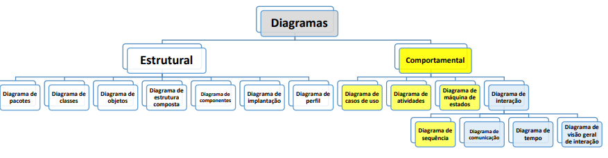
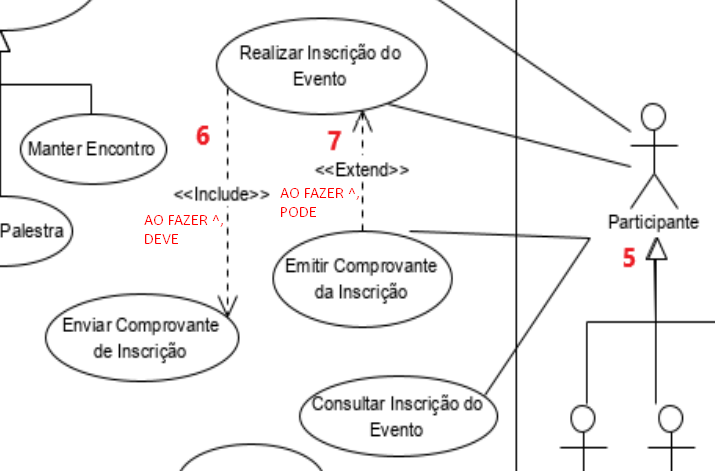
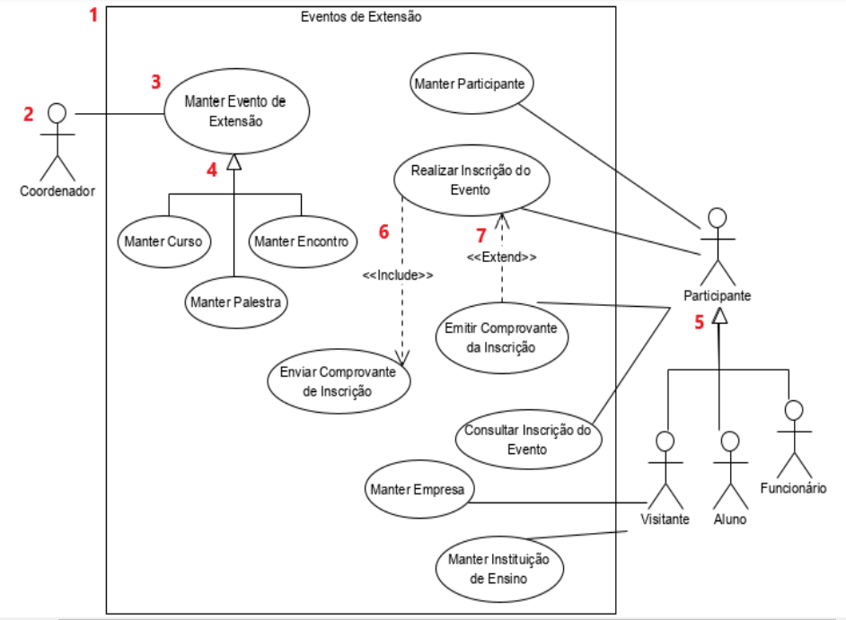
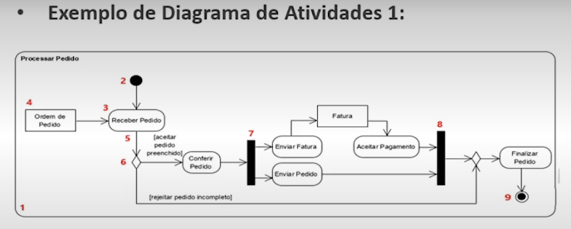
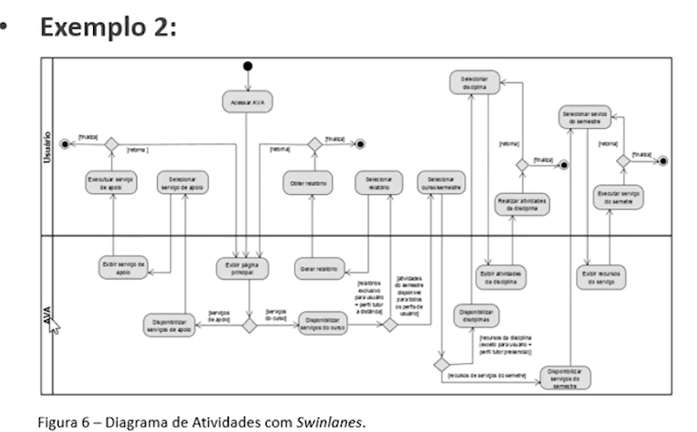

# Modelagem Comportamental 

É a Terceira etapa da modelagem.

Primeiro faz-se os **Casos de Uso**, depois **Modelagem Estrutural** (parte estática, das entidades e da comunicação entre elas), **depois a Comportamental**

Modelagem da parte Dinâmica do Sistema 

UML é **Sempre orientado a Casos de Uso** - modelo abstrato, flexível e que tem o propósito de demonstrar os requisitos funcionais. 

A execução de um use case pode ser representada por um Diagrama Comportamental (Ex: Diagrama de Atividades) ou Diagrama de Interação (Ex: Sequência, Comunicação) para detalhar os objetos que trocam as mensagens entre si
 

## Relacionamentos

- INCLUDE (inclusão de comportamento) indica uma OBRIGATORIEDADE entre os elementos (DEVE)
- EXTENDS (Extensão do comportamento) indica um relacionamento opcional entre os elementos (PODE)
Exemplo:
Use Case 1: Realizar Inscrição no Evento
Use Case 2: Enviar Comprovante de Inscrição
Use Case 3: Emitir Comprovante da Inscrição

(USE CASE 1) INCLUDE ---> (USE CASE 2)
(USE CASE 3) EXTENDS ---> (USE CASE 1)
AO FAZER 1 DEVE 2 (1 INCLUDE 2)
AO FAZER 1 PODE 3 (3 EXTENDS 1)

Ex: 

## Diagrama de Casos de Uso

## Diagrama de Atividades

- Normalmente  o sistema é o sujeito (Receber Pedido, Enviar Fatura)
- Condição de Guarda entre Colchetes 

- Elementos: Atividade, Nó de Ação, nó de objeto, Nó de condição + Condição de Guarda, Barra de sincronização

