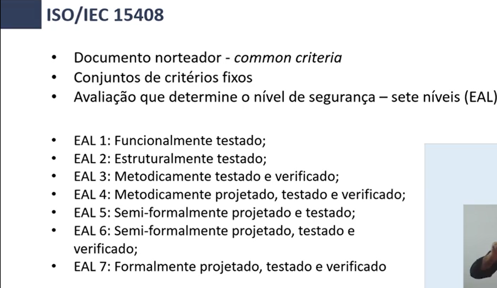
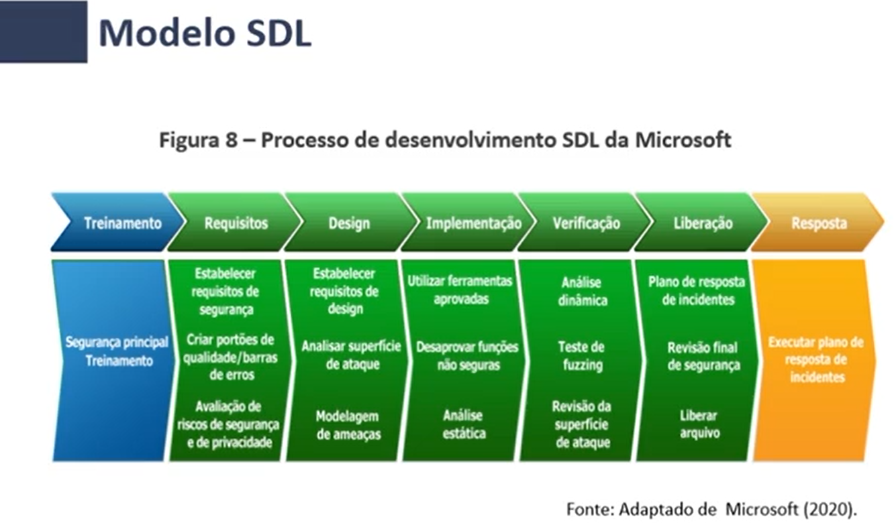

# PROCEDIMENTOS PARA GARANTIR A SEGURANÇA DO SOFTWARE

Qualidade e Segurança andam de mãos dadas.

Para McGraw (2005) essa relação é algo que complementa o software:
A segurança de software se relaciona inteira e completamente àqualidade. Devemos nos preocupar com a segurança, a confiabilidade, a disponibilidade e a dependência — nas fases inicial, de projeto, de arquitetura, de testes e de codificação, ao longo de todo o ciclo de vida [qualidade] de um software.

Até mesmo pessoas cientes do problema de segurança têm se concentrado em coisas relacionadas ao ciclo de vida do software. **O quanto antes descobrirmos um problema de software, melhor.** E existem dois tipos de problemas de software. O primeiro são os bugs, que são problemas de implementação. Os demais são falhas de software — problemas arquiteturais do projeto. As pessoas prestam muita atenção aos bugs, mas não o suficiente às falhas. (MCGRAW, 2005, p. 369)

## Metodologias
- NBR ISO/IEC 27001
- NBR ISO/IEC 27002
- ISO/IEC 15408

ISMS - information security management system
ISGS - sistema de gestão de segurança da informação

### ISO/IEC 15408

### Modelo SDL - Microsoft

