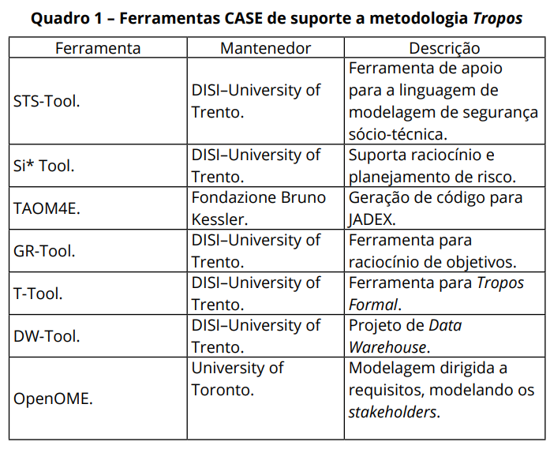

# TESTE DE SEGURANÇA EM APLICAÇÕES

# Metodologia Secure Tropos
Metodologia com a finalidade de modelar problemas de segurança durante todo o ciclo de desenvolvimento do produto software.
Conjunto de conceitos de requisitos da engenharia de domínio e engenharia de segurança, formando, assim, parâmetros de restrição de segurança, objetivos de segurança e ataques.
Faz uso da UML.

